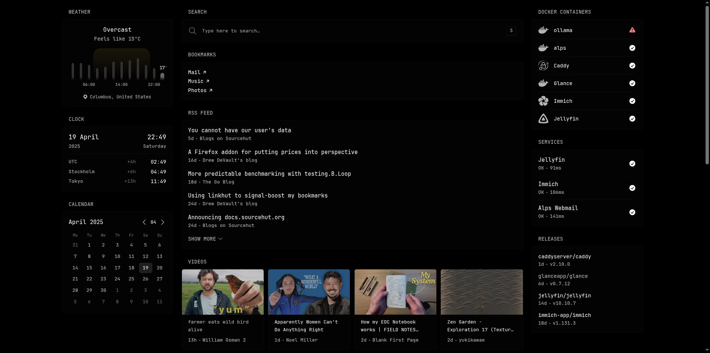

This repository consists of a few services' configurations and the Docker 
Compose files to run them. It is intended to be run once and forgotten about.

## Installation

Add docker:

```
apk add docker docker-cli-compose
```

Clone the repository:

```
git clone https://git.sr.ht/~jordanreger/homelab && cd homelab
```

Add the necessary `.env` files:

```
./.env
./caddy/.env
./immich/.env
```

Run it:
```
docker compose up -d
```

## Other configuration

To be able to use a custom domain for all my services, I've configured `caddy` 
to use Porkbun's API and set some specific records to allow for near-automatic 
service creation.

## Screenshots 


